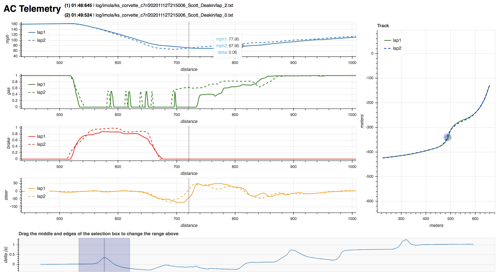

# Raw Sim Telemetry

Raw Simracing Telemetry logger, written initially to address the lack of tools for the PS4/XB1 on AC

# Getting started

    python3 -m venv py
    source py/bin/activate
    pip install -r requirements.txt

    python logger-ac.py [IP address]
    python plot.py [lap1] [lap2] output.html

# AC logger

    python logger-ac.py [IP address]

This will intiate the telemetry feed from an instance of AC running on the target IP.
It will log telemetry per lap into a subdirectory of the `log` directory, 
with one row per approximate meter travelled and a summary `laps.txt`

If the session is restarted, the logger should create a new sub-directory for the new set
of laps.  If you completely exit the session, it should detect the lack of updates and
stop the logging

# GT7 logger

This is still in progress 

    python logger-gt7 [IP address]

It will create a directory under `log/gt7/` with the current ISO DATETIME and then start writing `lap-n.txt` files there

It's based on the following:

- https://github.com/Nenkai/PDTools/blob/70af80d36262c3d276b93d63556c80e52a142054/PDTools.SimulatorInterface/SimulatorPacketG7S0.cs#L99
- https://www.gtplanet.net/forum/threads/gt7-is-compatible-with-motion-rig.410728/post-13800514

# Plotting

The plots use the [bokeh](https://docs.bokeh.org/en/latest/index.html) module to create a standalone HTML page.
You can see how this works with an included example:

    py/bin/python plot-example-split.py

or to compare other laps:

    py/bin/python plot.py [lap1] [lap2] output.html

This will create an output html file that looks something like this:

The plot uses `lap1` as the reference lap, so the `delta` is the amount `lap2` is ahead (-ve) or behind (+ve).
You can click on the legends to mute any trace and the bottom slider allows you to narrow down the
analysis to a specific range of measurements

# Reference

* https://docs.google.com/document/d/1KfkZiIluXZ6mMhLWfDX1qAGbvhGRC3ZUzjVIt5FQpp4/pub
* https://docs.bokeh.org/en/latest/index.html
* https://www.gtplanet.net/forum/threads/gt7-is-compatible-with-motion-rig.410728/post-13800514